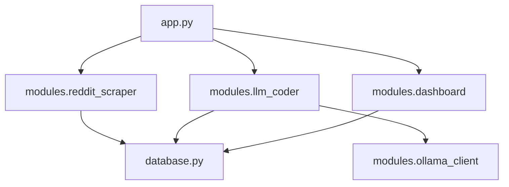

# Project Code Map

This document provides a hierarchical map of the `NootropicRedditScrapePPM` codebase, annotating key files and modules to help developers navigate the system.

## 📂 Root Directory

| File | Description |
| :--- | :--- |
| `app.py` | **Entry Point**. Main Streamlit application. Handles routing and session initialization. |
| `database.py` | **Data Layer**. SQLAlchemy ORM definitions and SQLite database connection/initialization. |
| `setup_models.py` | **Infrastructure**. Script to check/pull required Ollama models (`llama3.1`, `gemma3:12b`). |
| `pyproject.toml` | **Config**. Project metadata and strict dependency management. |
| `README.md` | **Documentation**. High-level overview, installation, and usage guide. |
| `TODO.md` | **Task Tracking**. Project status and roadmap. |
| `CITATION.cff` | **Metadata**. Academic citation information. |

## 📦 modules/

*Core business logic and functionality.*

| Module | Description |
| :--- | :--- |
| `reddit_json_service.py` (in `services/`) | **Collection Fallback**. Fetches public Reddit data via `.json` endpoints when PRAW fails. |
| `reddit_scraper.py` | **Collection**. Fetches posts/comments using `praw`. Handles validation and deduplication. |
| `llm_coder.py` | **AI Coding**. Integrates with Ollama for thematic analysis. Manages prompt engineering. |
| `dashboard.py` | **Visualization**. Renders charts and statistics using Streamlit primitives. |
| `ollama_client.py` | **Integration**. wrapper for Ollama API (localhost:11434). |

| `codebook.py` | **Management**. CRUD operations for qualitative coding schemas. |
| `data_manager.py` | **Administration**. Data export (CSV/JSON) and audit log viewing. |
| `reliability.py` | **Analysis**. Calculates inter-coder reliability (if applicable) and consensus metrics. |
| `thesis_export.py` | **Export**. Formats data specifically for thesis reporting. |
| `topic_modeling.py` | **Analysis**. BERTopic/LDA implementation for inductive topic discovery. |
| `zotero_manager.py` | **Integration**. Connects to Zotero API for literature review tagging. |

## 🛠️ utils/

*Helper functions and utilities.*

| File | Description |
| :--- | :--- |
| `db_helpers.py` | Database CRUD wrappers (save, load, update) for app modules. |
| `anonymize_data.py` | Utilities for hashing usernames and scrubbing PII for sharing datasets. |

## 📚 docs/

*Project documentation.*

| File | Description |
| :--- | :--- |
| `ARCHITECTURE.md` | System design, components, and data flow diagrams. |
| `dependencies.txt` | (Legacy) Text-based dependency list. |
| `netnographic_roadmap.md` | Methodological guidelines for digital ethnography. |

## 📐 Dependency Graph

