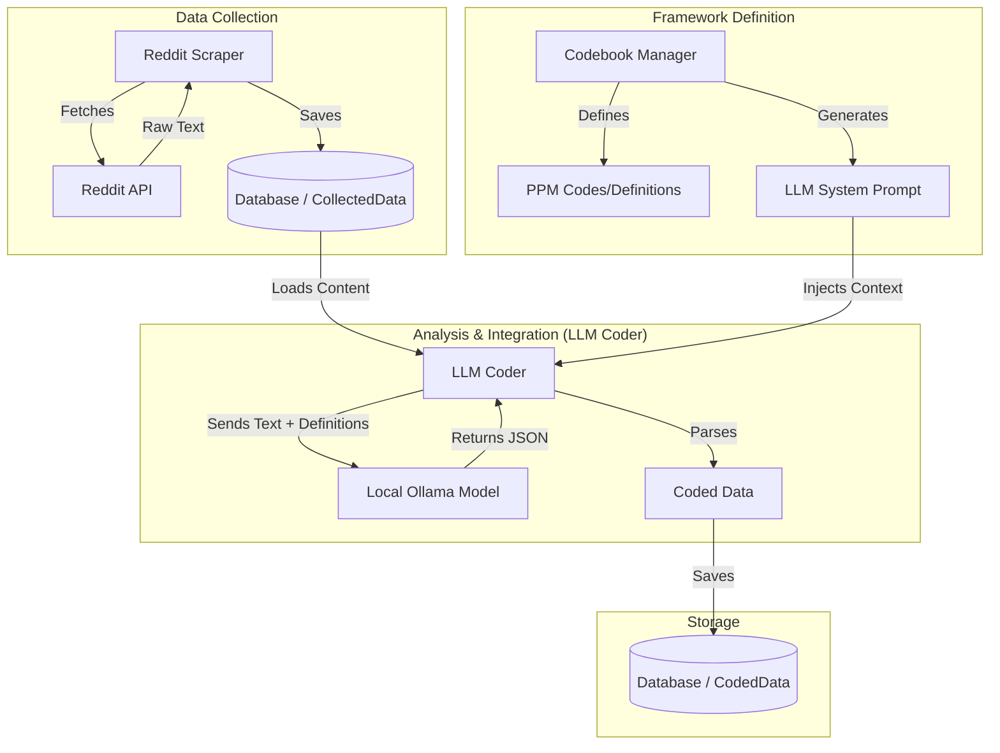

# Interaction Outline: Codebook & Reddit Components

This document outlines the architectural and functional interactions between the **Codebook** and **Reddit Data Collection** components within the `NootropicRedditScrapePPM` system.

## 1. High-Level Overview

The interaction between the Codebook and Reddit components is **asynchronous** and **mediated** by the **LLM Coder** module.

* **Reddit Scraper**: Responsible for raw data acquisition (posts/comments).
* **Codebook**: Responsible for defining the thematic framework (Push-Pull-Mooring).
* **LLM Coder**: The bridge that applies the Codebook definitions to the collected Reddit data to generate qualitative insights.

There is no direct runtime dependency between `reddit_scraper.py` and `codebook.py`. They meet only during the coding phase handled by `llm_coder.py` and share a storage layer via the database.

## 2. Component Roles

### A. Reddit Scraper (`modules/reddit_scraper.py`)

* **Function**: Connects to the Reddit API (PRAW) to fetch user-generated content.
* **Output**: Raw text data (titles, bodies, comments) and metadata (score, author, timestamp).
* **Storage**: Saves `CollectedData` records to the database.
* **Relationship**: Unaware of the Codebook or PPM framework. It solely focuses on gathering relevant text based on search queries (which may optionally be informed by Zotero keywords).

### B. Codebook (`modules/codebook.py`)

* **Function**: Defines the Push-Pull-Mooring (PPM) theoretical framework.
* **Data Model**: Manages `Code` objects (e.g., `PUSH-01`, `MOOR-I-02`) with definitions, inclusion/exclusion criteria, and examples.
* **Capabilities**:
  * **Prompt Generation**: Can export its structure as a text-based prompt for Large Language Models (`to_llm_prompt()`).
  * **Emergent Themes**: Manages inductive codes discovered during analysis.
* **Relationship**: Independent of the data source. It defines *what* to look for, not *where* to look.

### C. Automated Coder (`modules/llm_coder.py`) - The Integration Point

This module is where the interaction occurs. It orchestrates the flow of data from the Reddit component to the analysis logic defined by the Codebook.

1. **Data Retrieval**: Loads raw `CollectedData` (from Reddit Scraper) from the database/session state.
2. **Context Construction**:
    * Initializes the `CodebookManager`.
    * Extracts definitions for Push, Pull, and Mooring factors from the Codebook.
3. **Prompt Engineering**:
    * Constructs a specific prompt for the computational model (Ollama) that combines:
        * **The Content**: The Reddit post/comment text.
        * **The Rules**: The strict definitions and structure from the **Codebook**.
        * **The Task**: Instructions to apply the codes to the content.
4. **Processing**: Sends the prompt to the local computational model.
5. **Data Transformation**: Parses the model's JSON response to map Reddit content to specific Code IDs (`ppm_subcodes`) and emergent themes.
6. **Persistence**: Saves the result as `CodedData`, effectively linking a Reddit ID to Codebook IDs.

## 3. Data Flow Diagram



## 4. Key Interactions in Code

* **`llm_coder.py` imports `CodebookManager`**:

    ```python
    from modules.codebook import CodebookManager
    ```

* **Prompt Construction (`create_coding_prompt`)**:
    The system dynamically pulls current definitions from the Codebook to ensure the model uses the latest criteria.

    ```python
    # Inside modules/llm_coder.py
    push_section = format_codebook_section(CodeCategory.PUSH)
    # ...
    prompt = f"""...
    --- CODEBOOK DEFINITIONS ---
    {push_section}
    ..."""
    ```

* **Result Mapping**:
    The model is instructed to return `ppm_subcodes` (e.g., `["PUSH-01", "PULL-02"]`) which correspond directly to the IDs defined in `codebook.py`.

## 5. Summary

The interactions are **data-driven** and **schema-driven**:

1. **Reddit** provides the **Instance Data**.
2. **Codebook** provides the **Schema/Ontology**.
3. **LLM Coder** performs the **Mapping** (Classification) of Instance Data against the Schema.
